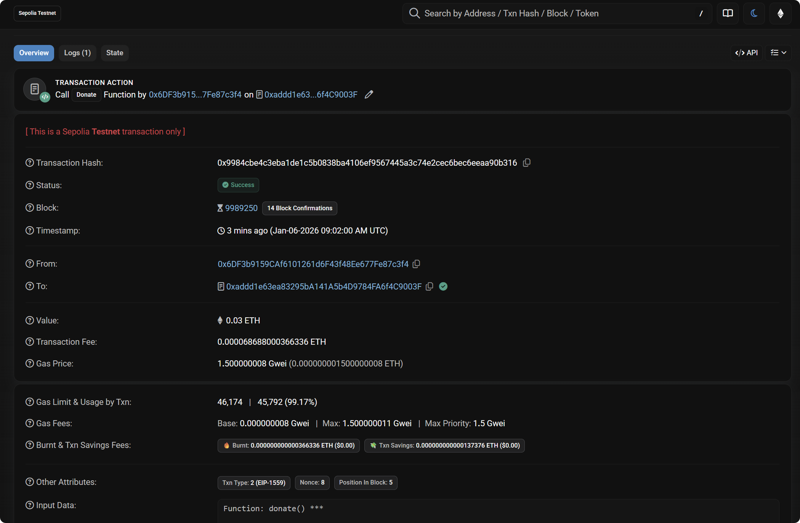
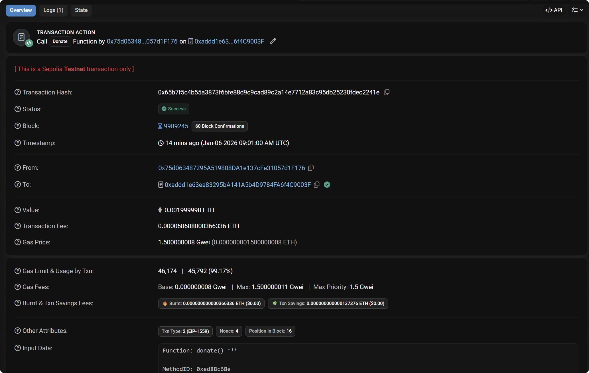
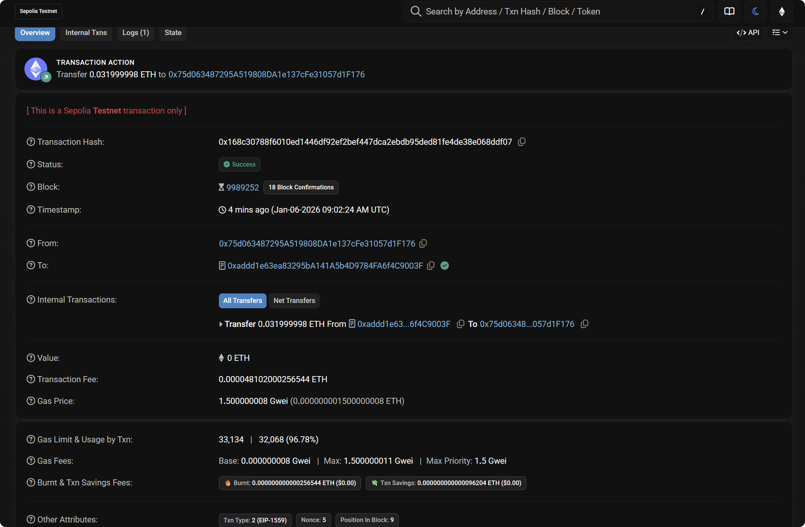

# BeggingContract 作业提交

---

## 📋 基础信息

| 项目 | 内容 |
|:------|:------|
| 网络 | Sepolia |
| 钱包地址 | `0x75d063487295A519808DA1e137cFe31057d1F176` |
| 捐赠者地址 | `0x6DF3b9159CAf6101261d6F43f48Ee677Fe87c3f4` |

---

## 📝 合约信息

| 项目 | 内容 |
|:------|:------|
| 合约文件 | `BeggingContract.sol` |
| 合约地址 | `0xaddd1e63ea83295ba141a5b4d9784fa6f4c9003f` |
| 部署交易 hash | `0x79a3ba6a23f1a388bf22031e6cf42d9c334b8e5a001b0b3e669a99fa4cbf5a3b` |

---

## ✨ 测试交易

| 项目               | 内容 |
|:-----------------|:------|
| donate 交易 hash   | `0x9984cbe4c3eba1de1c5b0838ba4106ef9567445a3c74e2cec6bec6eeaa90b316` |
| donate1 交易 hash  | `0x65b7f5c4b55a3873f6bfe88d9c9cad89c2a14e7712a83c95db25230fdec2241e` |
| withdraw 交易 hash | `0x168c30788f6010ed1446df92ef2bef447dca2ebdb95ded81fe4de38e068ddf07` |

---

## 📸 功能截图

### 1️⃣ Donate 捐款

> ✅ Remix 或 Etherscan，能看到 Success + Value

---

### 2️⃣ Withdraw 提现

> ✅ Remix 或 Etherscan，能看到 Success + 资金转出

