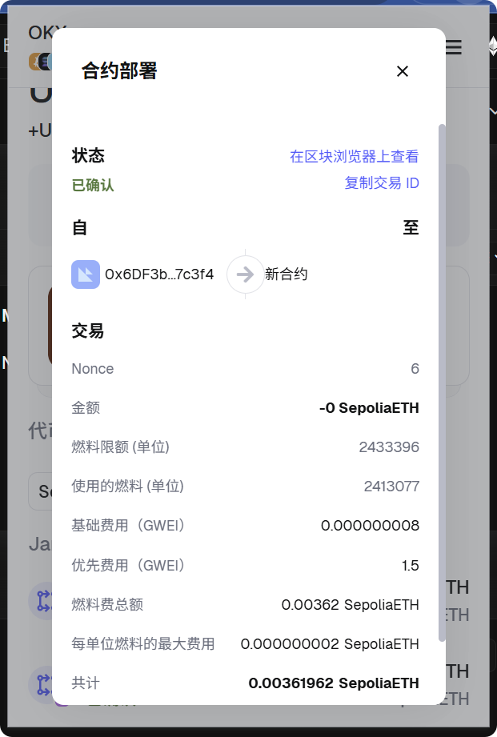
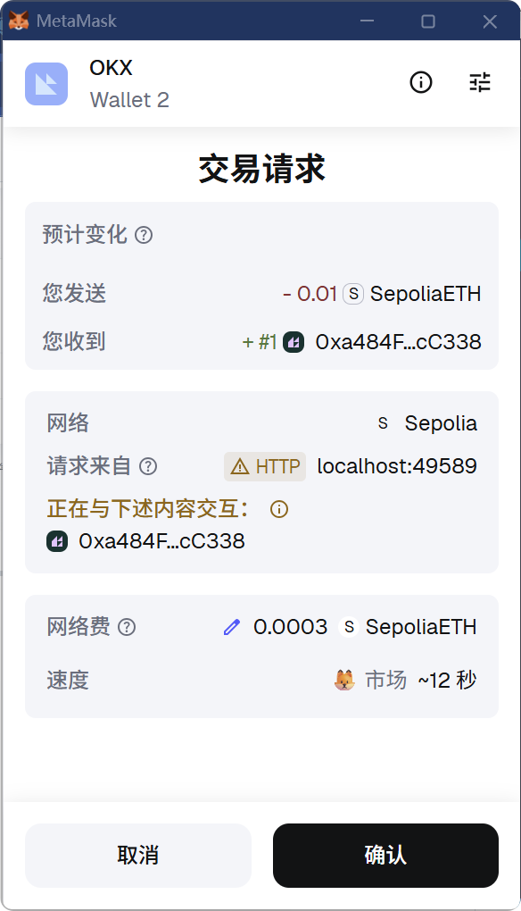
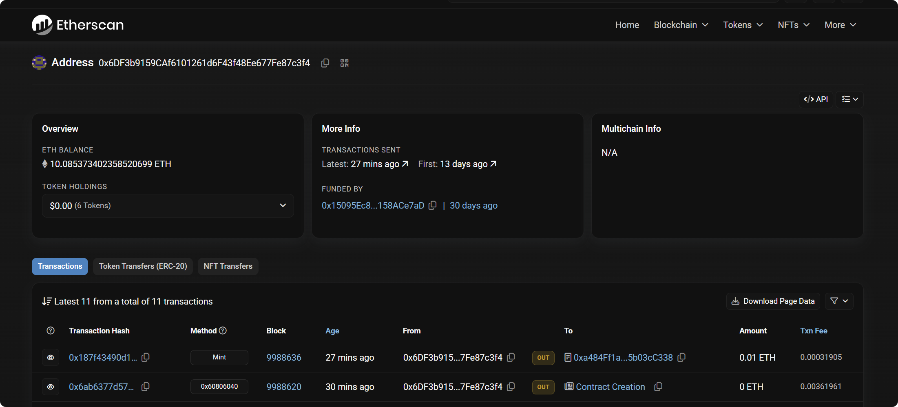
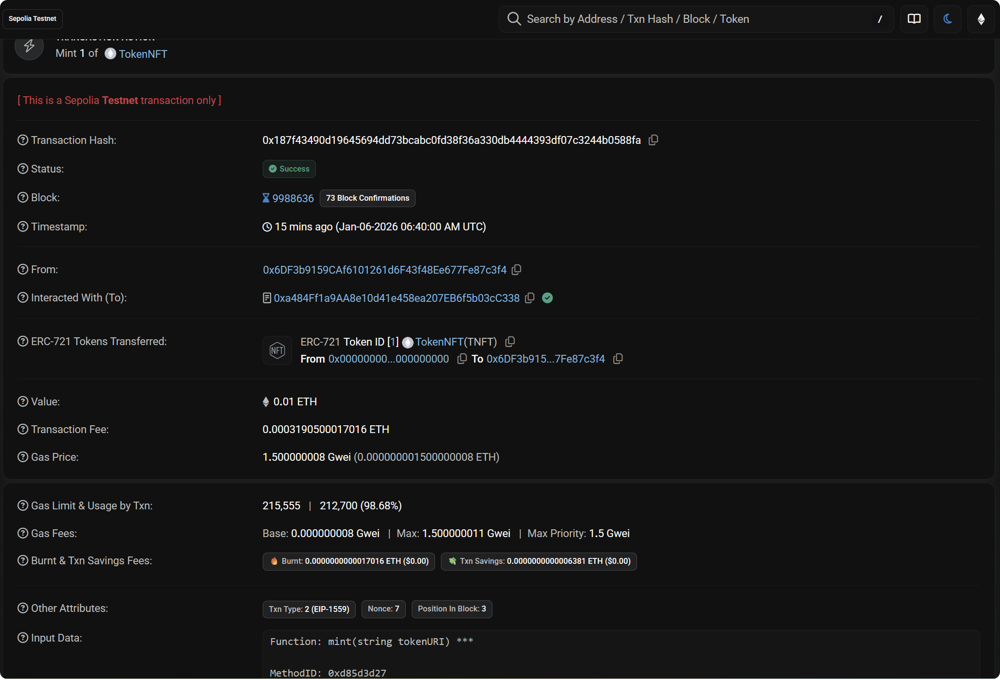
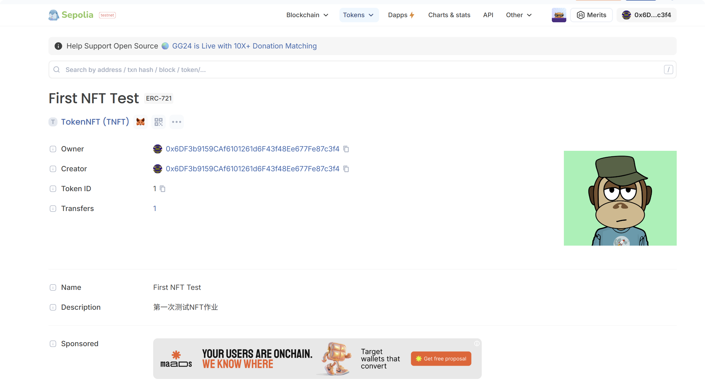

# TokenNFT 作业提交

---

## 📋 基础信息

| 项目 | 内容 |
|:------|:------|
| 网络 | Sepolia |
| 钱包地址 | `0x6DF3b9159CAf6101261d6F43f48Ee677Fe87c3f4` |

---

## 📝 合约信息

| 项目 | 内容 |
|:------|:------|
| 合约名 | `TokenNFT` |
| 合约地址 | `0xa484Ff1a9AA8e10d41e458ea207EB6f5b03cC338` |
| 部署交易 hash | `0x6ab6377d575cf314c6d82bcb69ba6b58d22bdf455891728939d9cfb8f50e7ca2` |

---

## ✨ 铸造信息

| 项目 | 内容 |
|:------|:------|
| mint 交易 hash | `0x187f43490d19645694dd73bcabc0fd38f36a330db4444393df07c3244b0588fa` |
| tokenId | `1` |
| tokenURI | `https://tan-key-tiger-457.mypinata.cloud/ipfs/bafkreihok7auee5m2nowu6xarxsre7u4vlbg5a5nyozekmzhwl6yndj2yy` |

---

## 🌐 IPFS 资源

| 项目 | 链接 |
|:------|------|
| metadata IPFS | `ipfs://bafkreihok7auee5m2nowu6xarxsre7u4vlbg5a5nyozekmzhwl6yndj2yy` |
| metadata 网关 | https://tan-key-tiger-457.mypinata.cloud/ipfs/bafkreihok7auee5m2nowu6xarxsre7u4vlbg5a5nyozekmzhwl6yndj2yy |
| image IPFS | `ipfs://bafkreign5xxptfgrw334pqz5vuzqthtwednaww63v6efst2bfhdavsdkoi` |
| image 网关 | https://tan-key-tiger-457.mypinata.cloud/ipfs/bafkreign5xxptfgrw334pqz5vuzqthtwednaww63v6efst2bfhdavsdkoi |

**metadata.json 原文：**

```json
{
    "name": "First NFT Test",
    "description": "第一次测试NFT作业",
    "image": "ipfs://bafkreign5xxptfgrw334pqz5vuzqthtwednaww63v6efst2bfhdavsdkoi"
}
```

---

## 📸 展示结果

### 1️⃣ 部署合约



---

### 2️⃣ Etherscan 合约页

> ✅ 能看到合约地址与交易列表



---

### 3️⃣ Etherscan mint 交易详情

> ✅ 能看到状态 Success、To=合约地址、Input 里包含 tokenURI





---

### 4️⃣ Sepolia Blockscout 资产展示


